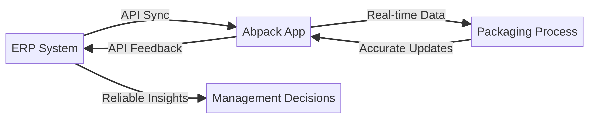
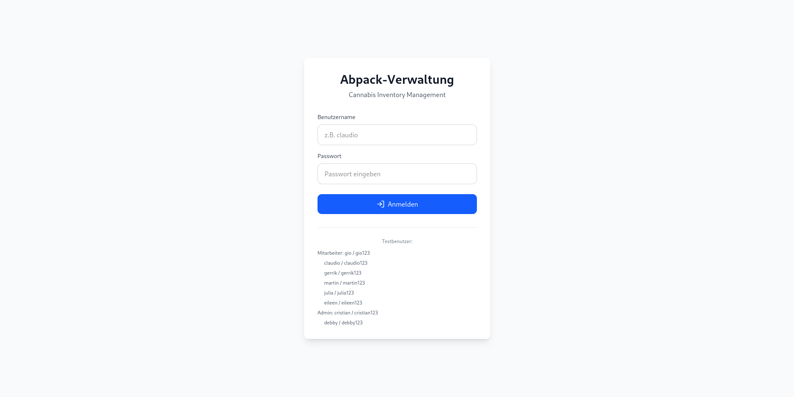
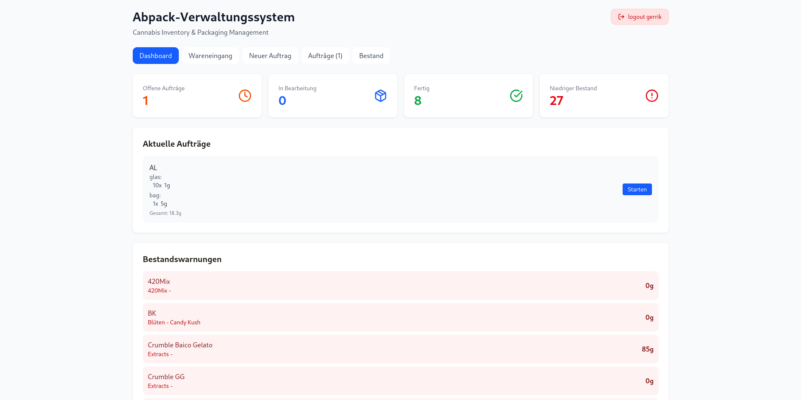
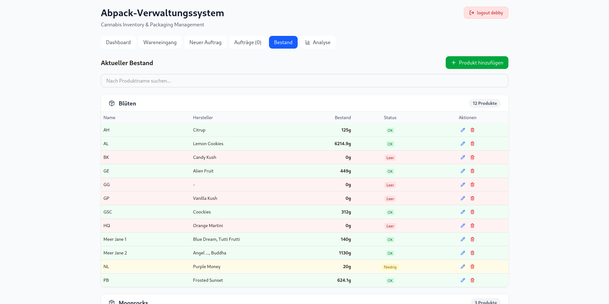
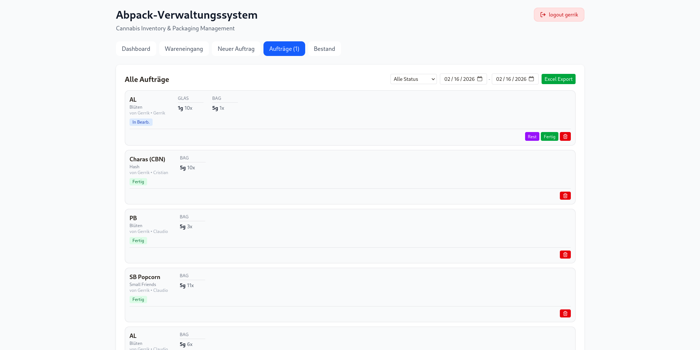
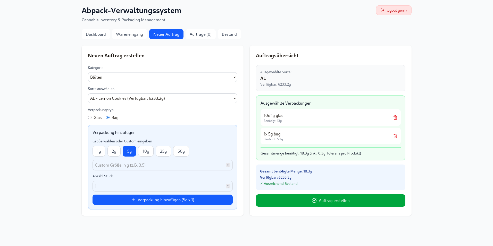
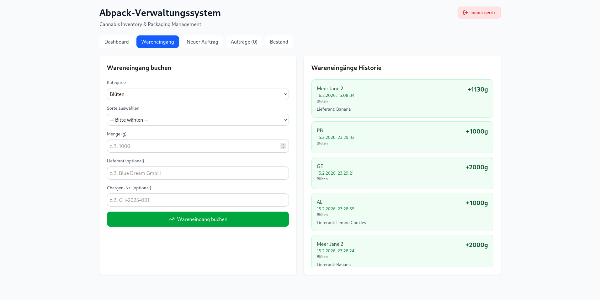

# Abpack-Verwaltungssystem

## Überblick

Das Abpack-Verwaltungssystem ist eine moderne Web-App zur Verwaltung und Analyse von Cannabis-Beständen, Aufträgen und Verpackungsprozessen. Die Anwendung unterstützt verschiedene Nutzerrollen (Mitarbeiter, Admin, Entwickler) und bietet eine intuitive Oberfläche für die tägliche Arbeit im Lager und der Produktion.

**Features:**
- Live-Bestand und Auftragsübersicht
- Produktmanagement (CRUD)
- Rollenbasierte Rechteverwaltung
- Tagesstatistiken und Dashboard
- Export von Aufträgen als Excel
- Mobile-optimierte Ansicht
- Benutzerverwaltung und Login

## Workflow




## Screenshots

### Login
Die Login-Seite ermöglicht den sicheren Zugang für verschiedene Nutzerrollen.


### Dashboard
Das Dashboard zeigt aktuelle KPIs, offene und fertige Aufträge sowie Statistiken auf einen Blick.


### Bestand
Hier werden alle aktuellen Bestände übersichtlich angezeigt und verwaltet.


### Aufträge
Die Auftragsübersicht listet alle laufenden und abgeschlossenen Aufträge.


### Neuer Auftrag
Mit wenigen Klicks kann ein neuer Auftrag angelegt werden.


### Wareneingang
Erfassung und Verwaltung von Wareneingängen im System.



## Technologiestack
- **Frontend:** React + TypeScript, Vite
- **Backend:** Node.js, tRPC, Express
- **Datenbank:** MySQL (Drizzle ORM)
- **Auth:** JWT, Cookie-basierte Sessions
- **Dev-Tools:** pnpm, Git

## Aufbau & Hauptlogik

### 1. Datenmodell

```typescript
// Beispiel: Order-Interface
interface Order {
  id: number;
  strain: string;
  strainName: string;
  categoryName: string;
  packagingType: string;
  packages: OrderPackage[];
  neededAmount: number;
  status: string; // 'offen', 'in_bearbeitung', 'fertig'
  createdAt: string | Date;
  updatedAt?: string | Date;
  createdByName?: string;
  processedByName?: string;
}
```

### 2. Dashboard-Logik

Das Dashboard zeigt tagesaktuelle KPIs und Aufträge:
- **Offene/In Bearbeitung:** werden immer übertragen
- **Fertig:** nur Aufträge, die heute abgeschlossen wurden

```typescript
const isToday = (dateInput: string | Date | undefined | null): boolean => {
  if (!dateInput) return false;
  const date = new Date(dateInput);
  if (isNaN(date.getTime())) return false;
  const today = new Date();
  return date.getDate() === today.getDate() &&
         date.getMonth() === today.getMonth() &&
         date.getFullYear() === today.getFullYear();
};

const visibleOrders = orders.filter((o: Order) => {
  if (o.status !== 'fertig') return true;
  return isToday(o.updatedAt) || isToday(o.createdAt);
});
```

### 3. Auftragsanzeige & Sortierung

Alle Aufträge werden nach Status sortiert:
- Offen (oben)
- In Bearbeitung (mitte)
- Fertig (unten)

```typescript
const statusPriority: Record<string, number> = {
  'offen': 0,
  'in_bearbeitung': 1,
  'fertig': 2
};

const filteredOrders = visibleOrders
  .sort((a, b) => (statusPriority[a.status] ?? 99) - (statusPriority[b.status] ?? 99));
```

### 4. Produktmanagement (CRUD)

Admins und Entwickler können Produkte direkt im UI anlegen, bearbeiten und löschen. Die Rechte werden über die Rolle geprüft:

```typescript
const canManageProducts = user?.role === 'admin' || user?.role === 'dev';
```

### 5. Export-Funktion

Aufträge können als Excel-Datei exportiert werden. Der Zeitraum wird über zwei Datumsfelder gefiltert.
