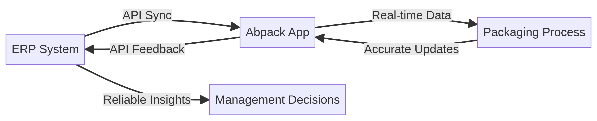
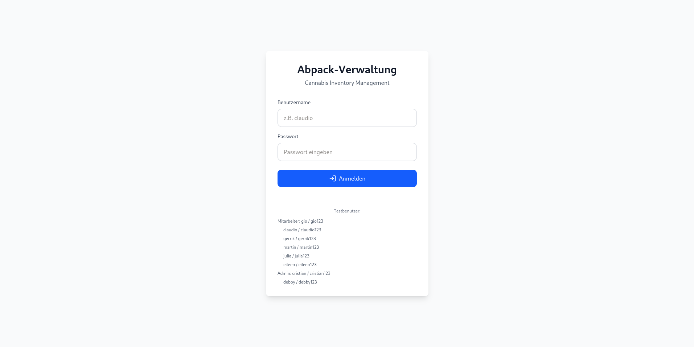
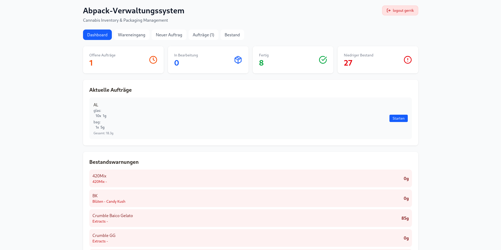
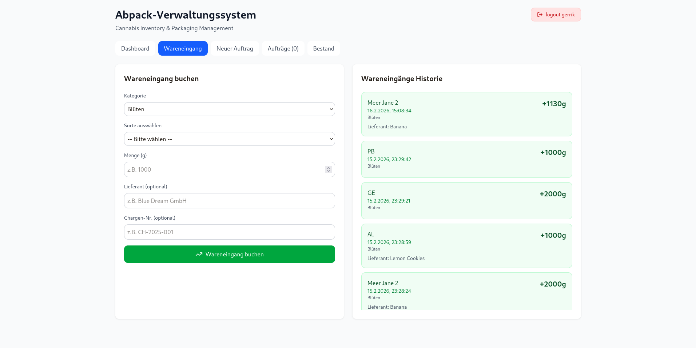
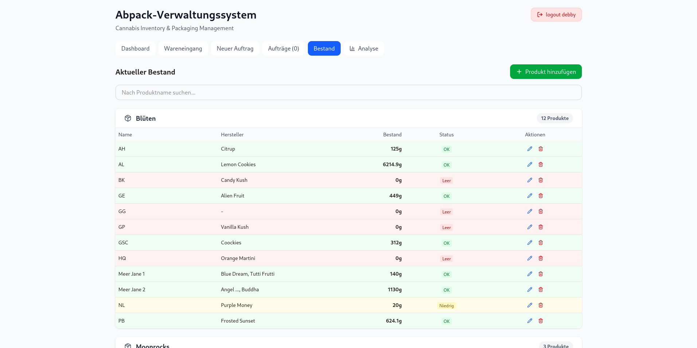
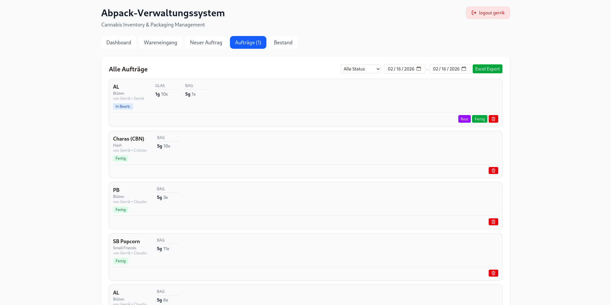
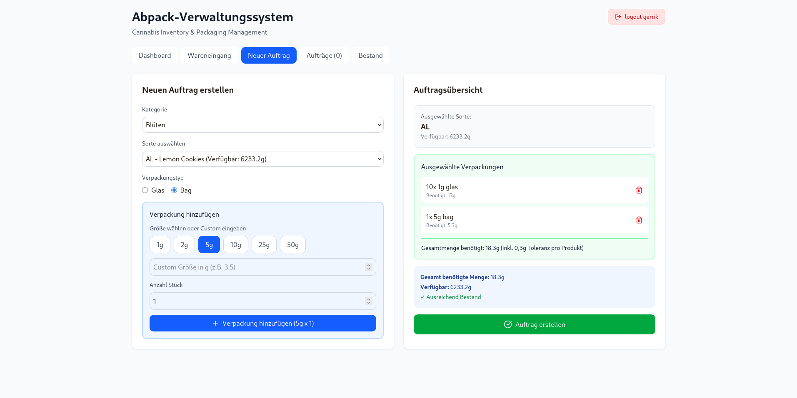

> Built to replace manual, paper-based warehouse workflows and save ~1 full workday per week

# 📦 Warehouse Tracking & Planning Tool

A custom-built application to digitize and optimize warehouse and production workflows in a small e-commerce environment.

---

## Overview

This project was created to replace inefficient, paper-based warehouse processes with a structured, data-driven system.

Originally, all operations (inventory tracking, production planning) were handled manually using printed sheets, which led to errors, lack of transparency, and significant time loss.

The application introduces a centralized system to manage inventory, track material flow, and support weekly sales planning.

---

## 🧩 Problem

- Manual, paper-based tracking of inventory and materials  
- No centralized data source  
- High risk of errors and missing information  
- Time-consuming planning for weekly sales cycles  
- No visibility into stock levels or product availability  

---

## 💡 Solution

- Built a custom application to track inventory and material usage  
- Digitized all relevant workflows into a structured system  
- Enabled faster and more accurate production planning  
- Replaced spreadsheets and manual processes with a scalable solution  

---

## ⚙️ Tech Stack

- **Backend:** Python, Flask  
- **Database:** PostgreSQL / MySQL  
- **Frontend:** HTML, JavaScript  
- **Tools:** Git, Linux/macOS (CLI)  

---

## 📊 Impact

- ⏱️ Reduced manual work by approximately **8 hours per week**  
- 📉 Lowered risk of human error in inventory tracking  
- 📈 Improved planning efficiency for weekly sales cycles  
- 🔍 Increased transparency of warehouse operations  

---

## 🔄 Development Process

The solution was developed iteratively:

1. Started with **Google Sheets** for basic tracking  
2. Migrated to **AppSheet** for structure  
3. Rebuilt as a **custom application** for full control and scalability  

---

## 🖥️ Features

- Inventory tracking  
- Material flow management  
- Support for production planning  
- Centralized data handling  
- Improved workflow organization  

---

## 🧠 What I Learned

- Building real-world applications to solve business problems  
- Structuring and managing operational data  
- Working with backend frameworks and databases  
- Iterative development and improving systems over time  
- Using CLI (Linux/macOS) for development and workflow management  

---

## 📸 Screenshots

---

## 📬 Contact

If you're interested in my work or have questions, feel free to reach out.
